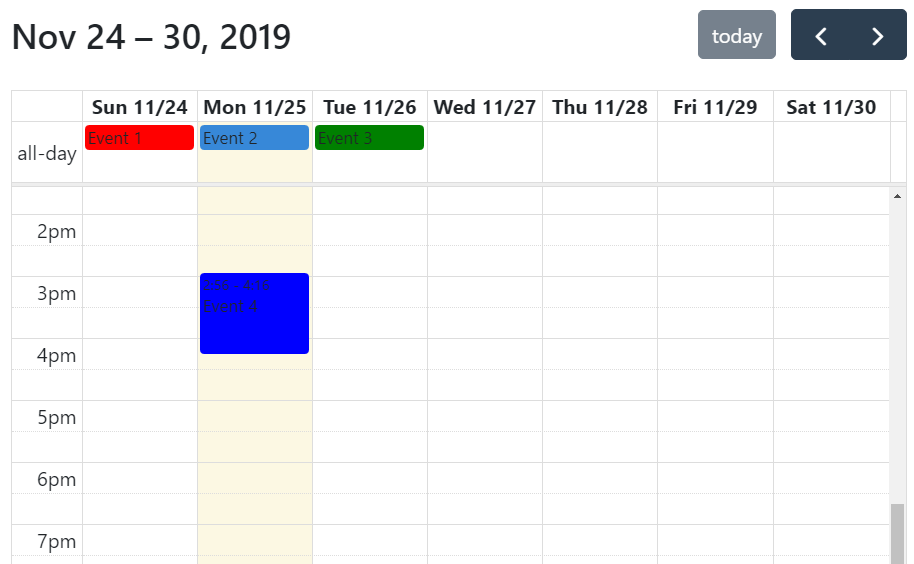

<!-- README.md is generated from README.Rmd. Please edit that file -->

```{r, include = FALSE}
knitr::opts_chunk$set(
  collapse = TRUE,
  comment = "#>",
  fig.path = "man/figures/README-",
  out.width = "100%"
)
```
# fullercalendar 

<!-- badges: start -->
[](https://travis-ci.org/ari-nz/fullercalendar)
[](https://codecov.io/gh/ari-nz/fullercalendar?branch=master)
[](https://www.tidyverse.org/lifecycle/#experimental)
<!-- badges: end -->

The goal of fullercalendar is to ...

## Installation

You cannot yet install the released version of fullercalendar from [CRAN](https://CRAN.R-project.org), but when you can you can do so with:

``` r
install.packages("fullercalendar")
```

And the development version from [GitHub](https://github.com/) with:

``` r
# install.packages("devtools")
devtools::install_github("ari-nz/fullercalendar")
```
## Example


```{r example}
library(fullercalendar)

```


```{r basic-usage}
now = Sys.time()
today = Sys.Date()
events = data.frame(title = paste("Event", 1:4),
                 start  = c(isodate(today+(-1:1)), isotime(now)),
                 end    = c(isodate(today+(0:2) ), isotime(now + 4800)),
                 color  = c("red", "#3788d8", "green", "blue"))

head(events)


```

```{r display, eval=FALSE, echo=FALSE}
fullercalendar(events)
```




## Shiny Example

``` r
library(shiny)
library(fullercalendar)

ui <- fluidPage(
  fullercalendarOutput('mycal'),
)

server <- function(input, output, session) {
  output$mycal = renderFullercalendar({
    fc = fullercalendar(events)
    fc
  })
}

shinyApp(ui, server)
```
