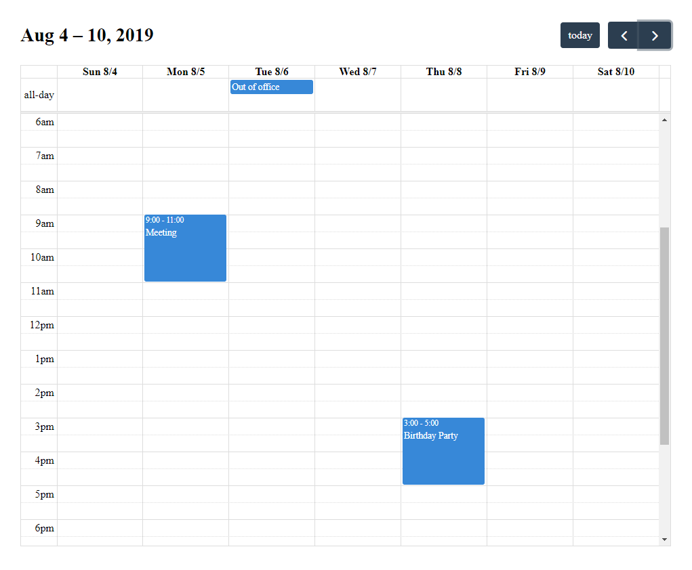

<!-- README.md is generated from README.Rmd. Please edit that file -->

```{r, include = FALSE}
knitr::opts_chunk$set(
  collapse = TRUE,
  comment = "#>",
  fig.path = "man/figures/README-",
  out.width = "100%"
)
```


  <!-- badges: start -->
  
  [](https://travis-ci.org/ari-nz/fullercalendar)
  [](https://codecov.io/gh/ari-nz/fullercalendar?branch=master)
  [](https://CRAN.R-project.org/package=fullercalendar)

  <!-- badges: end -->
  
  
# fullercalendar
The goal of fullercalendar is to provide bindings to the Fullcalendar JavaScript library in R, for use primarily in Shiny applications.

## Installation

You can install the development version of `fullercalendar` from [GitHub](https://github.com/ari-nz/fullercalendar) with:

``` r
# install.packages("remotes")
remotes::install_github("ari-nz/fullercalendar")
```
## Example


```{r example, eval = FALSE}
library(fullercalendar)
fullercalendar()
```




## Shiny Example


```{r, eval = FALSE}
library(shiny)
library(fullercalendar)

ui <- fluidPage(
  fullercalendarOutput('mycal'),
)

server <- function(input, output, session) {
  output$mycal = renderFullercalendar({
    fc = fullercalendar()
    fc
  })
}

shinyApp(ui, server)
```

